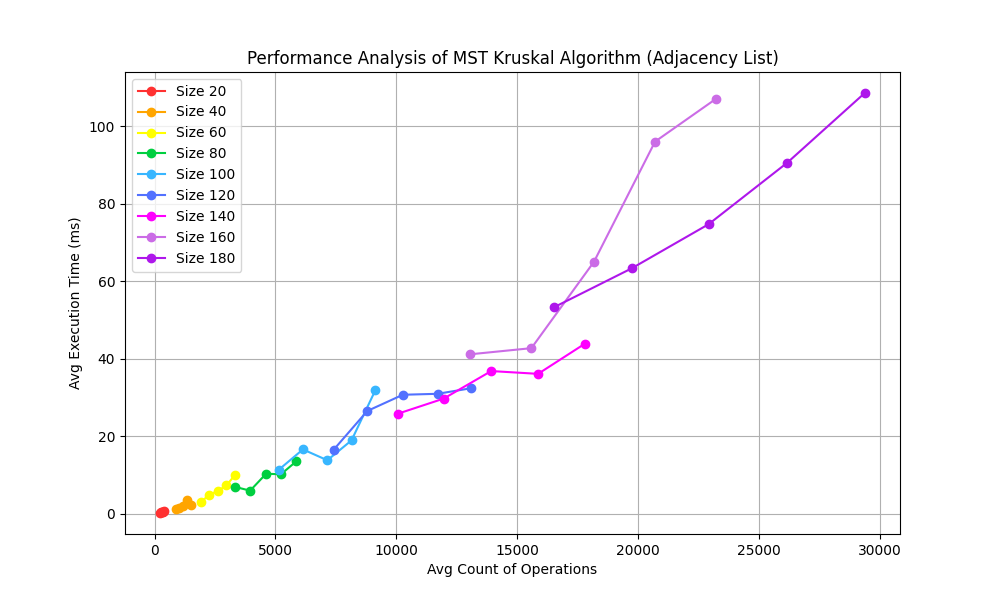
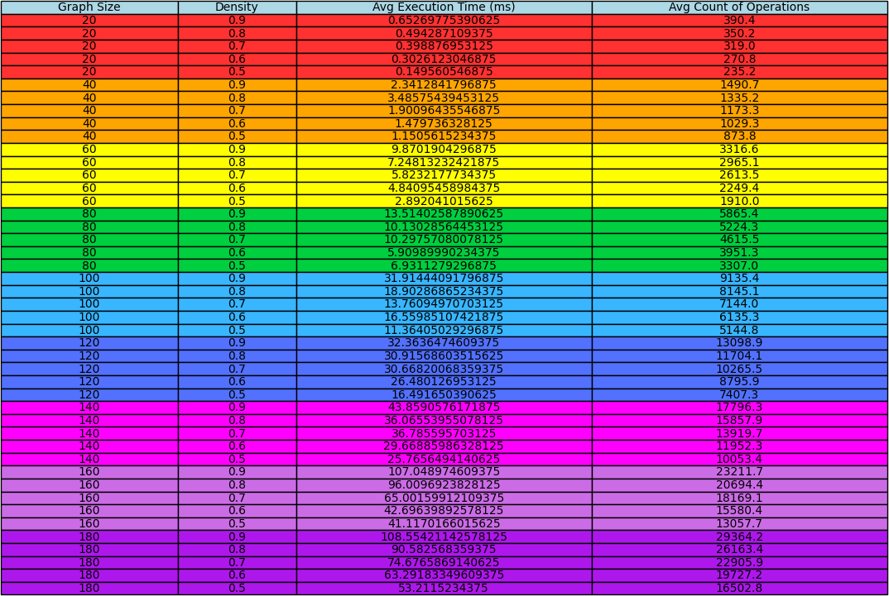

# MST Kruskal Algorithm Performance Analysis Project

This repository contains Python code for implementing and analyzing the performance of the Minimum Spanning Tree (MST) Kruskal's algorithm using both **adjacency list** and **adjacency matrix** representations. The algorithm's execution time and operations count are measured across different graph sizes and densities.


##  🎭 Background

This project was completed as a final project for the **Discrete Mathematics** course at KSE University.

## 👀 Overview

The project components include:

- **`myGraph.py`**: Classes for graph representation, random graph generation, and visualization using NetworkX and Matplotlib.

- **`Kruskal.py`**: Implementation of Kruskal's algorithm utilizing a priority queue and union-find data structure.

- **`main.py`**: Functions for running experiments to analyze algorithm performance and visualizing the results.

## 📌 Requirements

- Python 3.x
- PyCharm, Microsoft Visual Studio or other IDE
- NetworkX
- Matplotlib

## 💻 Usage

1. Clone the repository:

   ```bash
   git clone https://github.com/slash4r/python-kruskal-algorithm
   ```
   
2. Install dependencies:
   ```bash
   pip install networkx matplotlib
   ```
   
3. Run experiments:

   Navigate to the repository directory and execute:
   ```bash
   python main.py
   ```
   Modify `use_matrix` in `main.py` to `True` for **adjacency matrix** representation.

## 🕵️‍♂️ Experimentation

The `main.py` script conducts experiments by generating random graphs and applying Kruskal's algorithm to find the MST. It measures execution times and operations, visualizing results with plots and tables using `matplotlib`.

Each experiment is conducted in the following manner:

- **Graph Sizes**: Experimentation is performed across 10 different sizes of graphs, ranging from 20 to 180 nodes.

- **Densities**: Each experiment covers 5 different densities, ranging from 0.5 to 0.9.

- **Repetitions**: For each combination of graph size and density, 20 experiments are conducted with random graph generation.

- **Graph Representations**: Experiments are conducted using both adjacency list and adjacency matrix representations of the graph.

These experiments systematically analyze the performance of Kruskal's algorithm under varying graph sizes, densities, and representations to provide insights into its efficiency and scalability.

Feel free to explore the detailed experimental setup and results within the provided code and visualizations. Adjustments to experiment parameters can be made to further explore different scenarios and optimize algorithm performance.

## 🤩 Visualization

The algorithm's execution can be visualized using NetworkX and Matplotlib, showcasing the MST generation process.

In this project, the `visualize_solution(graph, mst_edges)` is used to visualize the Minimum Spanning Tree (MST) generated by Kruskal's algorithm:

```python
# Find MST using Kruskal's algorithm
mst_kruskal = MSTKruskal(graph)
mst_edges = mst_kruskal.kruskal_mst(print_info=True, return_info=False, use_matrix=True)  # or use_matrix=False

# Visualize the MST
visualize_solution(graph, mst_edges)
```
The `visualize_solution` function takes a graph object (`graph`) and the list of edges representing the MST (`mst_edges`) as input parameters to generate a visual representation of the Minimum Spanning Tree (MST) using NetworkX and Matplotlib. This function helps in **dynamically visualizing** the MST generation process for better comprehension.

⚠️ **Note**: It is recommended to use small graphs with small/medium density for visualization. Using large graphs with high density may result in messy and visually overwhelming plots that could be strenuous for interpretation. I am really worried about your eyes 🥺

**How it looks**:


---

All graphics and tables are generated programmatically within the `main.py` script using the Matplotlib library. This ensures that the experimental results are automatically visualized and presented for analysis.

The following functions are used for visualizing the experimental results:

- `create_colored_graph(results, sizes, color_map, use_matrix)`: This function creates a colored graph plot based on the experiment results, graph sizes, and color mapping.

- `create_colored_table(results, headers, col_widths, color_map)`: This function generates a colored table displaying the experiment results with specified headers, column widths, and color mapping.

These functions play a crucial role in visualizing and analyzing the performance metrics of Kruskal's algorithm across different graph configurations.

**Examples**:





## 🌴 File Structure

```plaintext
mst-kruskal-performance/
│
├── myGraph.py
├── Kruskal.py
├── main.py
├── Heap.py
├── README.md
└── .gitignore
```


## 📚 Additional Notes

- **Heap.py**: The code references a `PriorityQueue` implementation, it was made by **ChatGPT**!

- **Experiment Parameters**: Adjust `sizes` and `density` in `main.py` to customize experiment settings.
